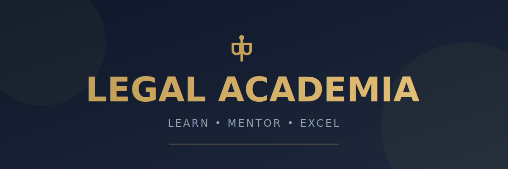
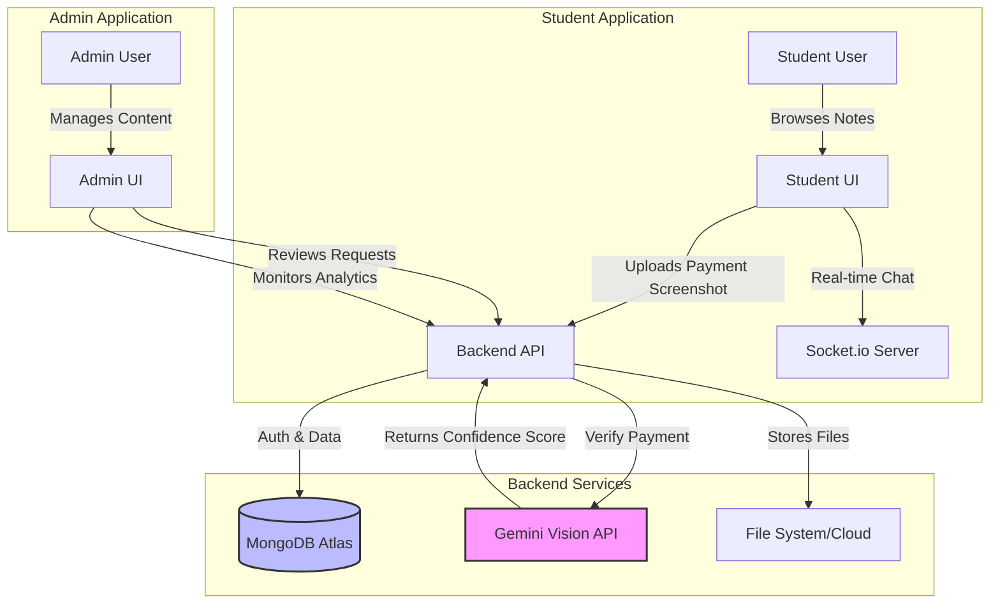

# ⚖️ Legal-Academia Platform



<div align="center">

[](https://reactjs.org/)
[](https://nodejs.org/)
[](https://expressjs.com/)
[](https://www.mongodb.com/)
[](https://tailwindcss.com/)
[](https://deepmind.google/technologies/gemini/)

<br />

**A comprehensive EdTech platform connecting Law Students with Premium Notes, Expert Mentorship, and AI-Powered Assistance.**

[View Demo](#) · [Report Bug](#) · [Request Feature](#)

</div>

---

## 🚀 Overview

**Legal Academia** is a dual-interface web application designed to revolutionize legal education. It seamlessly bridges the gap between students seeking high-quality legal resources and mentors offering expert guidance.

At its core, the platform leverages **Google's Gemini AI** to automate complex administrative tasks, such as verifying payment screenshots for premium content access. This ensures a secure, spam-free environment for content creators and instant access for students.

## 🏗️ System Architecture



## 🌟 Key Features

### 🎓 Student Portal
*   **📚 Premium Note Marketplace**: Access categorized legal notes (Constitution, IPC, Torts, etc.).
*   **🤖 AI-Powered Instant Access**: Upload your payment screenshot. Our AI analyzes it instantly. If valid (correct amount, UTR, success status), you get **immediate access**.
*   **👨‍⚖️ Expert Mentorship**: Book 1:1 sessions with legal experts.
*   **💬 Real-Time Chat**: Integrated chat for instant doubt resolution with mentors.
*   **🔒 Secure Viewer**: Read purchased notes securely within the browser.

### 🛡️ Admin Dashboard
*   **📊 Analytics Command Center**: Visualize total users, revenue, and active notes.
*   **✨ Smart Request Management**:
    *   **Auto-Verified**: Requests cleared by AI.
    *   **Suspicious Flagging ⚠️**: AI detects fake receipts, selfies, or wrong amounts and flags them for manual review.
*   **📝 Content Management**: inclusive tools for uploading and categorizing PDF notes.

## 🛠️ Tech Stack

| Domain | Technologies |
| :--- | :--- |
| **Frontend** | React.js (Vite), Tailwind CSS, Lucide Icons, Framer Motion |
| **Backend** | Node.js, Express.js, Socket.io |
| **Database** | MongoDB Atlas |
| **AI / ML** | **Google Gemini 1.5 Flash** (Multimodal Vision API) |
| **Authentication** | JWT (JSON Web Tokens), BCrypt |
| **DevOps** | Render (Deployment), GitHub Actions (CI/CD) |

## ⚡ Getting Started

Follow these steps to set up the project locally on your machine.

### Prerequisites

*   Node.js (v16 or higher)
*   npm or yarn
*   MongoDB Atlas Account
*   Google AI Studio API Key

### Installation

1.  **Clone the repository**
    ```bash
    git clone https://github.com/Yashuu213/Legal-academia.git
    cd Legal-academia
    ```

2.  **Install Dependencies**
    ```bash
    # Install server dependencies
    cd server
    npm install

    # Install client dependencies
    cd ../admin-app
    npm install
    cd ../student-app
    npm install
    ```

3.  **Environment Configuration**
    Create a `.env` file in the `server` directory:
    ```env
    PORT=5000
    MONGO_URI=your_mongodb_connection_string
    JWT_SECRET=your_secure_jwt_secret
    GEMINI_API_KEY=your_gemini_api_key
    ```

4.  **Run the Application**
    Open three separate terminal windows:

    *   **Terminal 1 (Server):**
        ```bash
        cd server
        npm start
        ```
    *   **Terminal 2 (Admin App):**
        ```bash
        cd admin-app
        npm run dev
        ```
    *   **Terminal 3 (Student App):**
        ```bash
        cd student-app
        npm run dev
        ```

## 📱 Application Structure

```bash
Legal-academia/
├── server/                 # REST API & Socket Server
│   ├── models/            # Database Schemas
│   ├── routes/            # API Route/Controllers
│   └── utils/             # AI Integration Logic
├── admin-app/             # React Admin Dashboard
│   └── src/pages/         # Protected Admin Routes
└── student-app/           # React Student Interface
    └── src/pages/         # Public & Protected Student Routes
```

## 🤝 Contributing

Contributions are what make the open-source community such an amazing place to learn, inspire, and create. Any contributions you make are **greatly appreciated**.

1.  Fork the Project
2.  Create your Feature Branch (`git checkout -b feature/AmazingFeature`)
3.  Commit your Changes (`git commit -m 'Add some AmazingFeature'`)
4.  Push to the Branch (`git push origin feature/AmazingFeature`)
5.  Open a Pull Request

## 📄 License

Distributed under the MIT License. See `LICENSE` for more information.

---

<div align="center">
  Built with ❤️ by <a href="https://github.com/Yashuu213">Yashuu213</a>
</div>
